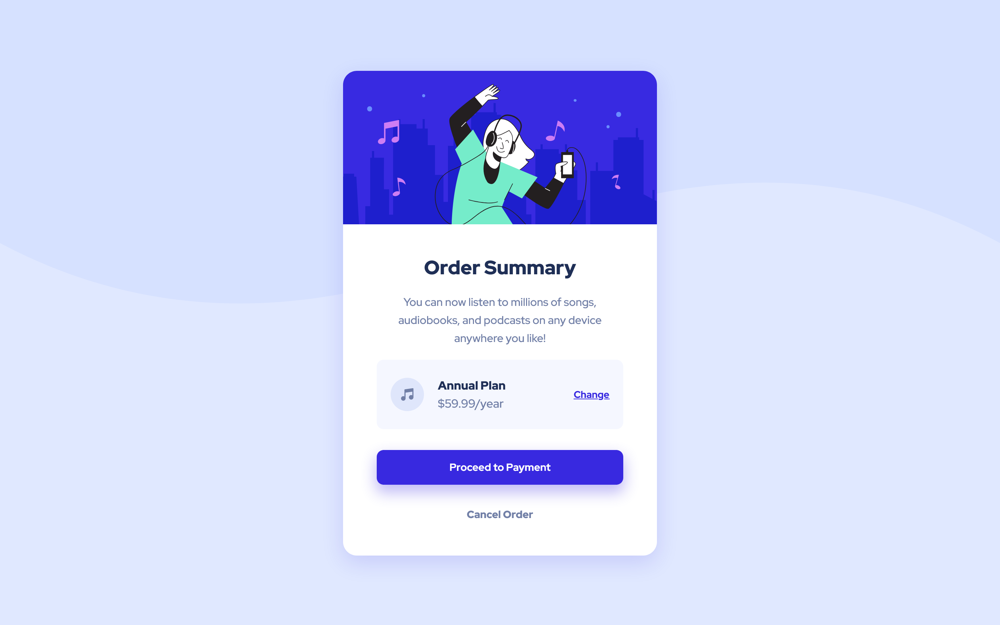

## Welcome! 👋🏼

# Frontend Mentor - Order Summary Card

 challenges help you improve your coding skills by building realistic projects


## Table of contents    

- [Overview](#overview)
  - [The challenge](#the-challenge)
  - [Screenshot](#screenshot)
  - [Links](#links)
- [My process](#my-process)
  - [Built with](#built-with)
  - [What I learned](#what-i-learned)
  - [Continued development](#continued-development)
  - [Useful resources](#useful-resources)
- [Author](#author)
- [Acknowledgments](#acknowledgments)

## Overview


## The challenge

- build out this order summary card component and get it looking as close to the design as possible.
- See hover states for interactive elements

### Screenshot




### Links

- Solution URL: [solution URL](https://github.com/M-lakshan/FM_Challenge-Order-Summary-Component-Main)
- Live Site URL: [live site URL](https://m-lakshan.github.io/FM_Challenge-Order-Summary-Component-Main/)

## My process

### Built with

- Semantic HTML5 markup
- CSS custom properties
- Flexbox
- Mobile-first workflow
- with Visual Studio Code Editor

### What I learned

I learned an uncommon CSS property while building this project

```css
a {
  text-underline-offset: **px;
}
```
what this property does is, give us the accessibility to control the distance between the anchor tag's default underline & the tag's baseline. we can set the distance according to our needs.

### Continued development

I never knew this property exists in CSS until I follow this project & I'm hoping to use this property in my future builds.

### Useful resources

- [developer.mozilla.org](https://developer.mozilla.org/en-US/docs/Web/CSS/text-underline-offset) more about the 'text-underline-offset' CSS property 

## Author

- Frontend Mentor - [@M-lakshan](https://www.frontendmentor.io/profile/M-lakshan)
- Dev.to - [@mlakshan](https://dev.to/mlakshan)
